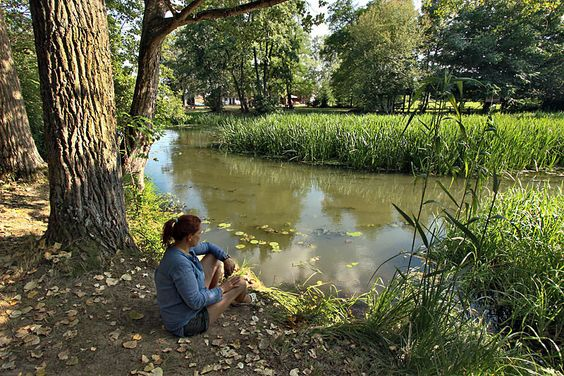

<!DOCTYPE html>
<html>
<head>
	<meta charset  ="utf-8">
<meta name="viewport" content="width=device-width, initial-scale=1">

<title>The Road</title>
	
</head>
<body>

	

		

		

		

	

	

		<nav class="nb">
			

				

				

			

         

         	<a href="#" class="n-a center">Home</a>
         	<a href="#" class="n-a center">Tours</a>
         	<a href="#" class="n-a center">About Us</a>
         	<a href="#" class="n-a center">Offer</a>
         	<a href="#" class="n-a center">Contact</a>
         

		</nav>
	

	<header class="header" >
		

			<h1 class="h1">Around the world</h1>
			
"Traveling-it leaves you speechless, then turns you into a storyteller"

		

		
		

			<h1>
			t
			h
			e
			r
			o
			a
			d
		</h1>
		

	</header>
	<section class="s1">
		<h1 class="s1-h">The Most Popular Tours</h1>
		

			

				

					
					<h1 class="n1">The wild forest</h1>
					<ul class="c-l">
						<li class="c-l1">7 days tour</li>
						<li class="c-l1">Up to 20 people</li>
						<li class="c-l1">4 tour guides</li>
						<li class="c-l1">SLeep in privatte tents</li>
						<li class="c-l1">Dificulty: medium</li>
					</ul>
					<button class="n-b">
						price &gt;&gt;
					</button>
				

					

						<button class="n-b">
							&lt;&lt;back
						</button>
						<h3 class=t-p>$399</h3>
						<button class="c-b">Booking</button>
					

			

				

				

					
					<h1 class="n1">Along the river</h1>
					<ul class="c-l">
						<li class="c-l1">9 days tour</li>
						<li class="c-l1">Up to 30 people</li>
						<li class="c-l1">4 tour guides</li>
						<li class="c-l1">SLeep in privatte tents</li>
						<li class="c-l1">Dificulty: hard</li>
					</ul>
					<button class="n-b">
						price &gt;&gt;
					</button>
				

					

						<button class="n-b">
							&lt;&lt;back
						</button>
						<h3 class=t-p>$499</h3>
						<button class="c-b">Booking</button>
					

				

			

				

					
					<h1 class="n1">The Island beach</h1>
					<ul class="c-l">
						<li class="c-l1">5 days tour</li>
						<li class="c-l1">Up to 40 people</li>
						<li class="c-l1">8 tour guides</li>
						<li class="c-l1">SLeep in hotel</li>
						<li class="c-l1">Dificulty: easy</li>
					</ul>
					<button class="n-b">
						price &gt;&gt;
					</button>
				

					

						<button class="n-b">
							&lt;&lt;back
						</button>
						<h3 class=t-p>$599</h3>
						<button class="c-b">Booking</button>
				

			

		

	</section>
	<section class="s2">
		

			<video class="vd" autoplay muted loop>
				<source src="vd1.mp4" type="video/mp4">
			</video>
		

		

			

				

					
					

						<h1 class="s-h">These were the best days of this year</h1>
						

						Lorem ipsum dolor sit amet, consectetur adipiscing elit, sed do eiusmod tempor incididunt ut labore et dolore magna aliqua. Ut enim ad minim veniam, quis nostrud exercitation ullamco laboris nisi ut aliquip ex ea commodo consequat. Duis aute irure.	
						

					

				

			

						

				

					
					

						<h1 class="s-h">I enjoyed this great tour </h1>
						

						Lorem ipsum dolor sit amet, consectetur adipiscing elit, sed do eiusmod tempor incididunt ut labore et dolore magna aliqua. Ut enim ad minim veniam, quis nostrud exercitation ullamco laboris nisi ut aliquip ex ea commodo consequat. Duis aute irure.	
						

					

				

			

		

	</section>
	<section class="cont">
		<h1 class= "cont-h">Contact Us</h1>
      <form class="cont-f center">
      	

      		<label>Full Name *</label>
      		<input type="text" class="cont-i" placeholder="Enter Your Name">
      	 

      	 

      	 	

      		<label>Email *</label>
      		<input type="email" class="cont-i" placeholder="Enter Your Email">
      	 

      	 

      		<label>Phone </label>
      		<input type="text" class="cont-i" placeholder="Enter Phone Number">
      	 

      	 

      	 

      	 	<label>Message</label>
      	 	<textarea class="f-t" placeholder="Your Message Here..."></textarea>
      	 

      	 <input type="submit" value="Submit" class="f-b">
      </form>
	</section>
	<footer class="ft">
		

			<a href="#" class="ft-a">Home</a>
			<a href="#" class="ft-a">Tours</a>
			<a href="#" class="ft-a">About Us</a>
			<a href="#" class="ft-a">Offer</a>
			<a href="#" class="ft-a">Contact</a>
		

			
Copyright &copy; CodeAndCreate All Rights Reserved 

		

	</footer>

</body>
</html>  
